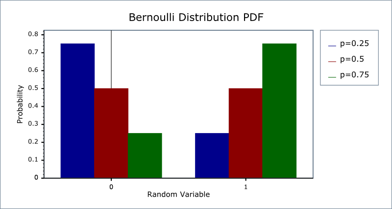

## 
Basic Statistics

### Useful Links

[Python Quick Reference](https://www.python.org/ftp/python/doc/1.1/quick-ref.1.1.html)

[Python3 cheat sheet](https://perso.limsi.fr/pointal/_media/python:cours:mementopython3-english.pdf)

[Python.org](https://www.python.org/)

[Python Standard Library](https://docs.python.org/3/library/index.html)

[Python Functions](https://docs.python.org/3/library/functions)

---

|<td colspan=3> 
<bold><h3>**Table of contents**
|||
|---|:---|:---:|
|**01.**|[**Basic Statistics**](#Basic-Statistics;)|statistical types of data types of probability distribution expected value mode, variance, median pearson correlation coefficient (PCC)|

**Statistical types of data**:  

Three main types:
- $x$ is an **ordinal** variable if $x\in\mathbb{N}$ (**Natural numbers** - whole, positive, **typically does not include 0**);  
$\;\;\;\;$e.g:  
    * Our age  
    * Amazon star reviews  
    * Likert scale (strongly agree [5], agree [4], neutral [3], disgree [2], strongly disagree [1])  
- $x$ is a **numerical** variable if $x\in\mathbb{R}$ (**Real numbers** - all rational and irrational numbers;  
- $x$ is an **categorical (or nominal)** variable if $x\in C$, where $C$ is a **finite set** of element (and typically there's **no order between the elements** of $C$)  
$\;\;\;\;$e.g:  
    * Yes/No,  
    * The categories of films/books  

**Types of probability distribution**:  

There are **two main types**:  
* **Discrete**; good for **categorical / ordinal** data  
* **Continuous**; good for **numerical** data  

**Discrete probability distributions** include:  

* Bernoulli Distribution  
* Uniform Distribution  
* Poisson Distribution  

**Continuous probability distributions** include:  

* Continuous Uniform Distribution  
* Gaussian Distribution  

**Bernoulli Distribution**:  

See NumPy section for creating random distributions in Python  

Any kind of events with **two possible outcomes (binary events**), e.g. flipping a fair coin  
The **probability mass function (PMF) `f`** over possible outcomes **k** is:  
  
**k** = success - outcome you want to keep track of (1 = success)  
**p** = probability of success (probability of failiure is 1-p)  
Every Bernoulli trial must be an **independant event**  

**Uniform Distribution**:  

See NumPy section for creating random distributions in Python  

Good to formalise **events with equal probability**  
e.g. drawing a heart, diamond, club, or spade from a deck of cards,  
$\;\;\;\;$ or rolling a number on a dice  
Has **one parameter n (the number of events)** where each event has the **same probability**  
from the set of realisation {a-b}, (otherwise probability is zero)  
**probability mass function (PMF) `f`**:  
  
**n** = number of events  

**Poisson Distribution**:  

See NumPy section for creating random distributions in Python  

Good to formalise **events occurring in a fixed interval of time (or space), or other specified interval types such as distance, area or volume**  
e.g. Number of patients visiting the GP between 10-11am  
$\;\;\;\;$or Number of rainy days in Edinburgh in a year  
**probability mass function (PMF) `f`**:  

  
Valid **only for values on the x-axis** 

e is Euler's number (e = 2.71828...)  
k is the number of occurrences  
k! is the factorial of x  
λ (sometimes written μ) is a potitive number equal to the expected value (EV) of X when that is also equal to its variance   

**Continuous probability distributions** include:  

* Continuous Uniform Distribution  
* Gaussian Distribution  

**Continuous Uniform Distribution**:  

The distribution describes an experiment where there is an **arbitrary outcome that lies between certain bounds**  
The **bounds are** defined by the parameters, **a and b**, which are the **minimum and maximum values**  
**probability density function (PDF) `f`**:  

  

  

**Gaussian Distribution**:  

See NumPy section for creating random distributions in Python  

For a **real-valued** (Rational and irrational numbers) random variable 
Informally called a bell curve, but there are other types of bell shaped distributions  
**probability density function (PDF) `f`**:  

  

**μ** (Mu) is the **mean** or expectation of the distribution (and also its median and mode)  
**σ** (Sigma) is the **standard deviation**  

When **μ=0 and σ=1**, this is called **Normal Distribution (Z)**  

  
Red curve is the **Standard normal distribution**  

**Normal distribution:**  
  

**Expected value**:  

The return you can expect for some kind of action  
Generalised as the weighted average  
The **basic expected value** formula:  
The probability of an event multiplied by the amount of times the event happens  
$ E(X) = P(x) * n $  

The formula changes slightly according to what kinds of events are happening.
For **discrete binomial events** (2 outcomes):  
$ E(X) = P(x) * X $   

For **discrete multiple events** (multiple probabilities):  
$ E(X) = \sum X * P(X) $  

**P(x)** = probability of success  
**X** = number of trials  

For a **continuous random variable**:  
  

The curve is esscentially broken up into smaller and smaller intervals and the weighted average is calculated similar to discrete distribution  4

**Mode**:  

Mode is the value with the highest probability (this will be in the center of a symetric distribution)  

Single mode = **Unimodel**  
Two or more modes = **Multimodel**  

**Variance**:  

Quantifies the spread around the mean  
Defined as the mean of the squared difference between the mean and the data  
For **Discrete** random variable:  
  
**μ** = expected value  

For **Continuous** random variable:  
  
**f(x)** = PDF  

**Medium**:  

The **middle value** in a sorted, ascending or descending, list of values  
  

  

**Pearson correlation coefficient (PCC)**:  

A measure of **linear correlation** between two sets of data  
It is the ratio between the covariance of two variables and the product of their standard deviations; thus it is essentially a normalized measurement of the covariance, such that the result always has a value between −1 and 1  

  
Where:
**n** = sample size  
**xi, yi** = individual sample points indexed with *i*  
 = (the sample mean); and analogously for ȳ  

Does not exactly mean that one event causes the other (but we can have an idea)  
Values closer to $\pm$1 = high correlation  
Values closer to 0 = low correlation  

[
**⬆ Top of Page ⬆**
](#Basic-Statistics)

---
